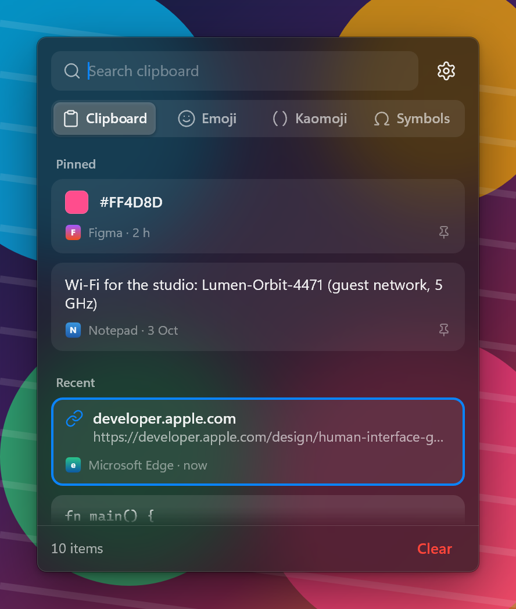
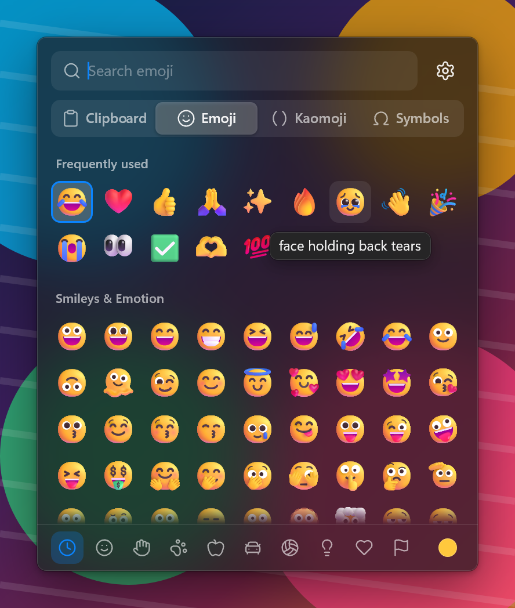
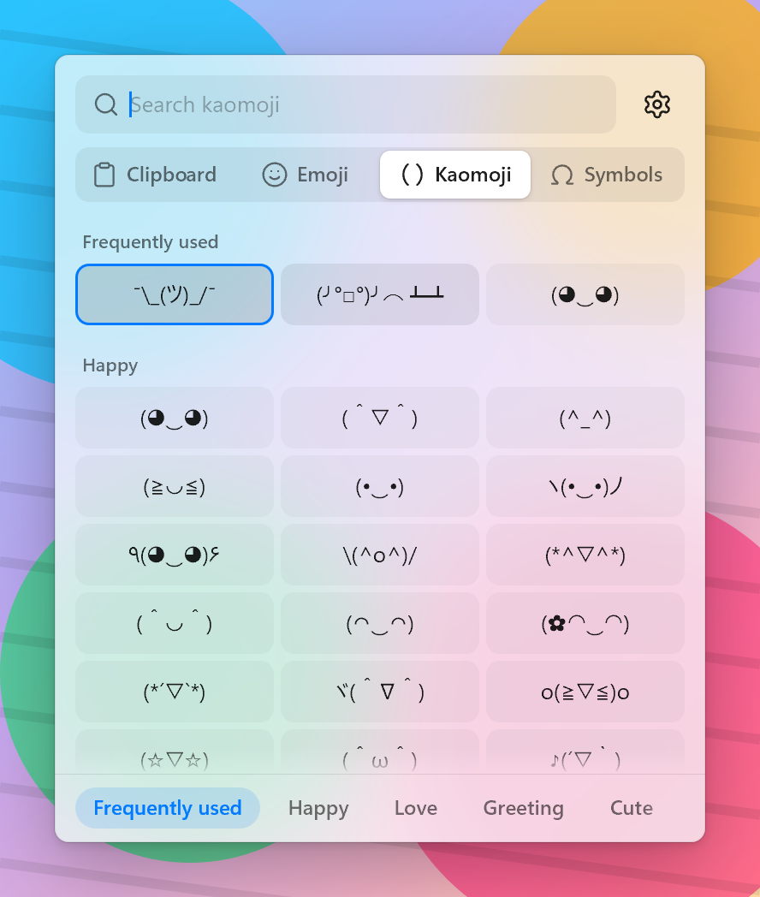

<p align="center"></p>

<h1 align="center">Tuck</h1>

<p align="center">One fast popup for Windows 11 that replaces the Win+V clipboard history and the Win+. emoji panel.<br>
Clipboard, Emoji, Kaomoji and Symbols in four tabs, right at your text caret.</p>

<p align="center"> </p>

## Why

Windows splits clipboard history and the emoji picker across two panels that open slowly, lose track of the caret
and forget everything you pinned when they misbehave. Tuck puts both in one panel that appears in a frame, never takes
focus away from the app you are typing in, and pastes or types straight back into it. History is encrypted with your
Windows account and stays on this PC.

## Features

- **Clipboard history:** text, rich text (HTML/RTF), images and files; links, colors, e-mail addresses, paths and code
  get their own card style; pin, delete, search (accent- and case-insensitive), paste as plain text, copy text from
  an image (OCR), open an image in [Glint](https://github.com/joxan2137/glint) when it is installed, show files in Explorer.
- **Emoji:** the full Unicode 18 set with the Fluent color artwork of Segoe UI Emoji, skin tones, frequently used,
  search by CLDR names and keywords. Emoji your font cannot draw are hidden.
- **Kaomoji and symbols:** about 300 curated kaomoji and 1,500 symbols (arrows, currency, math, Greek, box drawing,
  …), searchable by name, keyword or code point (`U+20AC`).
- **Private by default:** copies that apps mark as private (password managers) are never saved; pause recording or
  ignore individual apps; history survives restarts only if you want it to.
- **Settings:** grouped Apple-style preferences, light/dark themes, launch at login, import of the existing Windows
  clipboard history, install/uninstall.

<p align="center"></p>

## Shortcuts

| Keys | In the panel |
|---|---|
| Win+V | Open on Clipboard (again: close) |
| Win+. or Win+; | Open on Emoji (again: close) |
| Type | Search the current tab |
| Arrows, Page Up/Down, Home/End | Move the selection |
| Enter | Paste or insert the selection |
| Shift+Enter | Paste the other way (plain text vs. formatted) |
| Ctrl+Enter | Copy without pasting |
| Ctrl+1 … Ctrl+9 | Paste that card |
| Ctrl+P / Delete | Pin or delete the selected card |
| Tab, Ctrl+Tab (Shift: back) | Next or previous tab |
| Esc | Clear the search, then close |

## Install

Download `tuck.exe` from the [latest release](../../releases/latest) (or build it, below), then in PowerShell:

```powershell
& .\tuck.exe --install
```

This copies Tuck to `%LOCALAPPDATA%\Programs\Tuck`, starts it at login, adds a Start-menu entry and an "Apps"
uninstall entry. Nothing needs admin rights. Uninstall from the settings window, from Windows "Apps", or with
`tuck --uninstall` (add `--purge` to delete history and settings too). Windows' own clipboard history and emoji
panel settings are never changed: when Tuck is not running, the keys go back to Windows.

## Command line

```
tuck                          start in the tray
tuck --background             start silently (used at login)
tuck --clipboard | --emoji    open the panel on that tab
tuck --settings
tuck --install | --uninstall [--purge] | --quit
tuck --selftest [--json]      headless checks (catalogs, search, store, formats, previews, timing budgets)
tuck --preview <view> --out <png> [--theme dark|light] [--scale 1|1.5|2]
```

Preview views: `panel-clipboard`, `panel-clipboard-empty`, `panel-clipboard-search`, `panel-emoji`,
`panel-emoji-search`, `panel-emoji-tones`, `panel-kaomoji`, `panel-symbols`, `panel-menu`, `settings`,
`settings-clipboard`, `toast`, `app-icon`, `tray-icon`.

## Build

Requires Windows 10/11, the stable Rust MSVC toolchain and the Windows SDK (for `rc.exe`).

```powershell
cargo build --release -p tuck-app       # target\release\tuck.exe
cargo test --workspace
cargo run -p tuck-app --example make_icon   # redraws res\tuck.ico and res\tuck-256.png
```

## Layout

| Crate | What it does |
|---|---|
| `tuck-core` | Geometry, images, settings, clipboard items, hashes, history and its search, thumbnails |
| `tuck-ui` | Direct2D + DirectWrite + DirectComposition render kit, event loop, springs, widgets, color emoji |
| `tuck-sys` | Input hook and key routing, key-to-text, text and paste injection, caret lookup, tray, install, OCR |
| `tuck-clip` | The clipboard thread: watch copies, read and write every format, import Windows clipboard history |
| `tuck-store` | Persistent history: DPAPI-protected append-only log and image blobs |
| `tuck-emoji` | Emoji, kaomoji and symbol data, search, frecency, font coverage |
| `tuck-panel` | The panel view and its four tabs |
| `tuck-app` | The `tuck` binary: wiring, settings window, tray, toasts, CLI, previews, self-test, icon art |
| `tools/gen-data` | Offline generator for the emoji and symbol data |

[DESIGN.md](DESIGN.md) is the full design spec.

## Known limits

- Apps running as administrator get neither the keyboard hook nor injected input (Windows' UIPI), so Windows' own
  popups answer there. When Tuck opens over one anyway (from the tray or the command line), picks are copied
  instead of typed.
- IME composition is not available in the panel's search field.
- Games in exclusive fullscreen hide the panel.
- No GIF tab: Tenor's API shut down on 2026-06-30 and GIPHY needs a per-app key.
- Windows Terminal exposes no caret, so the panel opens at the focused element or at the mouse pointer there.
- Importing the Windows clipboard history works only from the settings window: Windows may deny clipboard-history
  access to an app in the background.

## Credits

Icons from [Lucide](https://lucide.dev) (ISC license) via the `icondata_lu` crate. Emoji, symbol names and keywords
from Unicode (`emoji-test.txt`, `UnicodeData.txt`) and CLDR annotations, © Unicode, Inc., used under the
[Unicode License v3](crates/tuck-emoji/data/LICENSE-UNICODE.txt).

## License

[MIT](LICENSE)
